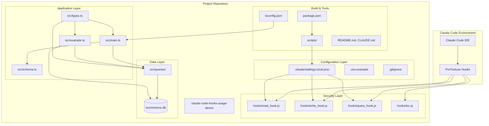
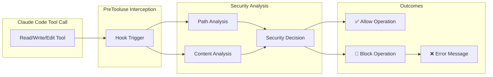
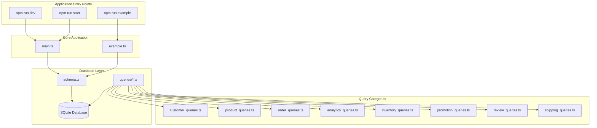
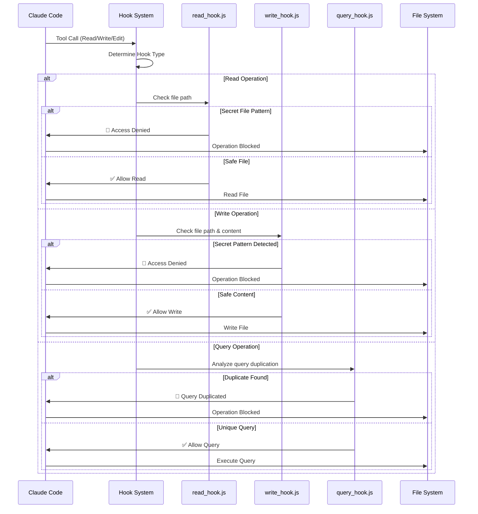
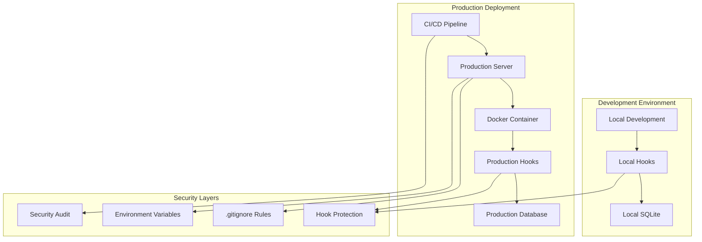

# Claude Code Hooks Usage Demo - Architecture Diagram

## 🏗️ High-Level Architecture



## 🔒 Security Hook Architecture



## 📊 Data Flow Architecture



## 🛡️ Security Pattern Detection

```mermaid
graph TB
    subgraph "Read Hook Protection"
        RPATH[Secret File Patterns]
        RPATH --> RENV[.env files]
        RPATH --> RCERT[Certificates (.pem, .key)]
        RPATH --> RSSH[SSH keys]
        RPATH --> RCONFIG[Config files]
        RPATH --> RCLOUD[Cloud credentials]
    end
    
    subgraph "Write Hook Protection"
        WPATH[File Path Blocking]
        WCONTENT[Content Pattern Detection]
        
        WPATH --> WPATHENV[.env paths]
        WPATH --> WPATHSECRET[secret/ paths]
        
        WCONTENT --> WPASSWORD[password= patterns]
        WCONTENT --> WAPIKEY[API key patterns]
        WCONTENT --> WTOKEN[token patterns]
        WCONTENT --> WPRIVATE[Private key blocks]
    end
    
    subgraph "Detection Patterns"
        OPENAI[sk-* OpenAI keys]
        GITHUB[ghp_* GitHub tokens]
        SLACK[xoxb-* Slack tokens]
        AWS[AWS access keys]
        DB[Database credentials]
    end
    
    WCONTENT --> OPENAI
    WCONTENT --> GITHUB
    WCONTENT --> SLACK
    WCONTENT --> AWS
    WCONTENT --> DB
```

## 🗂️ Project Structure Overview

```
claude-code-hooks-usage-demo/
├── 📁 .claude/                    # Claude Code configuration
│   ├── 📄 settings.example.json   # Hook configuration template
│   └── 📄 settings.local.json    # Active hook settings
│
├── 📁 hooks/                     # Security hook implementations
│   ├── 🔒 read_hook.js          # Blocks reading secret files
│   ├── 🛡️ write_hook.js         # Blocks writing secret content
│   ├── 🔍 query_hook.js          # Prevents duplicate queries
│   └── ⚙️ tsc.js               # TypeScript compilation hook
│
├── 📁 src/                       # Application source code
│   ├── 🚀 main.ts              # Application entry point
│   ├── 📚 example.ts            # Usage examples
│   ├── 🏗️ schema.ts             # Database schema
│   ├── 📋 types.ts              # TypeScript interfaces
│   └── 📁 queries/              # Database query modules
│       ├── 👥 customer_queries.ts
│       ├── 🛍️ product_queries.ts
│       ├── 📦 order_queries.ts
│       ├── 📊 analytics_queries.ts
│       ├── 📦 inventory_queries.ts
│       ├── 🎫 promotion_queries.ts
│       ├── ⭐ review_queries.ts
│       └── 🚚 shipping_queries.ts
│
├── 📁 scripts/                   # Utility scripts
│   └── 🔧 init-claude.js       # Hook setup script
│
├── 📄 .env.example              # Environment template
├── 📄 .gitignore               # Git ignore rules
├── 📄 package.json             # Project configuration
├── 📄 tsconfig.json            # TypeScript config
├── 📖 README.md                # Project documentation
└── 📋 CLAUDE.md                # Claude Code guidance
```

## 🔄 Hook Execution Flow



## 🎯 Key Components Summary

| Layer | Component | Purpose | Security Impact |
|--------|-----------|---------|----------------|
| **Configuration** | `.claude/settings.local.json` | Hook routing & timeouts |
| **Security** | `hooks/read_hook.js` | Blocks secret file access |
| **Security** | `hooks/write_hook.js` | Blocks secret content writing |
| **Security** | `hooks/query_hook.js` | Prevents duplicate queries |
| **Application** | `src/main.ts` | Demo entry point |
| **Data** | `src/queries/` | Business logic & data access |
| **Types** | `src/types.ts` | Type safety & interfaces |
| **Database** | `SQLite` | Data persistence layer |

## 🚀 Deployment Architecture



This architecture provides a comprehensive view of how the Claude Code Hooks Usage Demo project is structured, how security hooks protect against secret exposure, and how all components interact to provide a robust demonstration of Claude Code's hook system.
